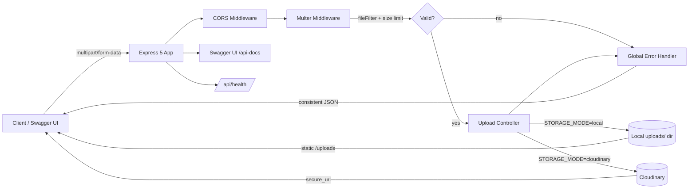

# File Upload API — Step-by-Step Build Guide

> **Archived: original build playbook.** This document is the original roadmap used to build the File Upload API. It captures the intended construction order, the reasoning behind each layer, and the acceptance criteria for every step. The codebase may have evolved since this guide was written, so treat it as a making-of narrative rather than a live specification. For the current setup, architecture, and deployment notes, see [../README.md](../README.md).

---

> **Project Summary:** File Upload API is a secure, production-ready REST API for uploading, listing, and deleting files. It exposes single and multiple file uploads (up to 5 files), validates every upload by MIME type and size, and supports two interchangeable storage backends — local disk and Cloudinary cloud storage — selected at runtime via an environment variable. Uploaded files receive collision-free UUID filenames. The API ships with interactive Swagger (OpenAPI 3.0) documentation, a centralized error handler that normalizes Multer, validation, and unexpected errors into consistent JSON, a health check endpoint, and a styled landing page. It is deployed on Render with Cloudinary for persistent storage. Stack: Node.js 18+, Express 5, Multer 2, Cloudinary, multer-storage-cloudinary, swagger-jsdoc, swagger-ui-express, dotenv, CORS, and UUID.

Each step below is a self-contained prompt. Execute them in order.

Stack: Node.js 18+, Express 5, Multer 2, Cloudinary, multer-storage-cloudinary, swagger-jsdoc, swagger-ui-express, dotenv, CORS, UUID (CommonJS modules).

---

## Table of Contents

**PHASE 1 — Backend Foundation**

- STEP 1 — Project Scaffolding & Dependency Setup
- STEP 2 — Environment & Central Configuration
- STEP 3 — Error Primitives & File Helpers

**PHASE 2 — Storage & Upload Pipeline**

- STEP 4 — Cloudinary Storage Adapter
- STEP 5 — Multer Middleware (Validation, Limits, Storage Switch)
- STEP 6 — Global Error Handler

**PHASE 3 — Controllers, Routes & API Documentation**

- STEP 7 — Upload Controller (Business Logic)
- STEP 8 — Routes & Swagger JSDoc Annotations
- STEP 9 — Swagger Specification Wiring

**PHASE 4 — Server Assembly**

- STEP 10 — Application Entry Point & Static Serving
- STEP 11 — Health Check & Landing Page

**PHASE 5 — Polish & Deploy**

- STEP 12 — README & Community Health Files
- STEP 13 — Render Deployment Configuration

**Appendices**

- Appendix A — Shared Constants
- Appendix B — Response Contract & Status Codes
- Appendix C — Common Pitfalls
- Appendix D — Pre-Flight Checklist

---

## Global Build Rules (apply to EVERY step)

- **No git operations.** Do not run `git` commands, do not commit, and do not push. Version control is handled manually by the user.
- Do not install unapproved packages. Only add a dependency when the step explicitly requires it.
- Do not run long-running processes (servers, watchers) unless the step or the user explicitly requests it.
- Treat every step as self-contained: read the target files, make the change, and verify the acceptance checklist before moving on.
- Keep code modern and idiomatic: ES6+, `async/await`, small focused functions, and the DRY principle.
- Function and variable names are English, descriptive, and camelCase.
- Validate inputs and sanitize anything derived from user input (filenames, params) before touching the filesystem.
- Prefer native Node.js APIs over new dependencies where practical.

---

## Architecture at a Glance



The Express app applies CORS and JSON parsing, then routes uploads through a Multer middleware that enforces the MIME whitelist and size limit. A storage switch chooses local disk or Cloudinary at startup based on `STORAGE_MODE`. Controllers shape the response payload; a single global error handler converts Multer errors, `ApiError` instances, and unexpected failures into a uniform JSON contract. Swagger UI is served from `/api-docs`, generated from JSDoc annotations on the route files.

---

# PHASE 1 — BACKEND FOUNDATION

---

## STEP 1 — Project Scaffolding & Dependency Setup

**Goal:** Establish the project skeleton, package metadata, and runtime scripts.

**Files/folders to create or edit:**

- `package.json`
- `.gitignore`
- `src/` (directory)

**Required dependencies:**

```bash
npm install express cors dotenv multer cloudinary multer-storage-cloudinary swagger-jsdoc swagger-ui-express uuid
```

**Implementation notes:**

- Set `"type": "commonjs"` and `"main": "src/server.js"`.
- Add scripts: `"start": "node src/server.js"` and `"dev": "node --watch src/server.js"` (use the native `--watch` flag instead of adding `nodemon`).
- Pin a Node engine: `"engines": { "node": ">=18.0.0" }`.
- `.gitignore` must exclude `node_modules/`, `uploads/`, `.env`, and `*.log`.

**Acceptance checklist:**

- [ ] `npm install` completes without errors.
- [ ] `package.json` exposes `start` and `dev` scripts.
- [ ] `uploads/` and `.env` are git-ignored.

---

## STEP 2 — Environment & Central Configuration

**Goal:** Provide a single typed configuration object sourced from environment variables.

**Files/folders to create or edit:**

- `.env.example`
- `.env` (local only, never committed)
- `src/config/index.js`

**Implementation notes:**

- Call `require("dotenv").config()` at the top of `src/config/index.js`.
- Parse and default each value: `PORT` (3000), `NODE_ENV` (`development`), `STORAGE_MODE` (`local`), `MAX_FILE_SIZE_MB` (5), `BASE_URL` (`http://localhost:${port}`).
- Group Cloudinary credentials under a `cloudinary` object.
- Export the MIME whitelist as `allowedMimeTypes` (see Appendix A) so every layer references the same source of truth.
- `.env.example` documents every variable with placeholder values and a note that Render uses an ephemeral filesystem.

**Acceptance checklist:**

- [ ] `require("./config")` returns a fully-populated object with sensible defaults.
- [ ] No secrets are hard-coded; all sensitive values come from `process.env`.
- [ ] `.env.example` lists every variable the app reads.

---

## STEP 3 — Error Primitives & File Helpers

**Goal:** Create reusable building blocks for error handling and filesystem work.

**Files/folders to create or edit:**

- `src/utils/ApiError.js`
- `src/utils/fileHelpers.js`

**Implementation notes:**

- `ApiError` extends the native `Error` and stores a `statusCode` and a `name` of `"ApiError"`.
- `fileHelpers` exposes:
  - `generateUniqueFilename(originalName)` — UUID v4 + original extension.
  - `getMaxFileSize()` — converts `maxFileSizeMb` to bytes.
  - `ensureUploadsDir()` — creates `uploads/` recursively if missing.
  - `deleteLocalFile(filename)` — sanitizes the name, then unlinks if present.
  - `getLocalFileUrl(req, filename)` — builds an absolute public URL.
  - `sanitizeFilename(filename)` — `path.basename()` to strip directory components and prevent path traversal.
- Resolve `uploadsDir` once with `path.join(__dirname, "../../uploads")` and export it.

**Security expectations:** Every filesystem operation that consumes a user-provided filename must route it through `sanitizeFilename` first.

**Acceptance checklist:**

- [ ] `new ApiError(400, "msg")` carries `statusCode` and `message`.
- [ ] `sanitizeFilename("../../etc/passwd")` returns only the basename.
- [ ] `generateUniqueFilename("photo.jpg")` preserves the `.jpg` extension.

---

# PHASE 2 — STORAGE & UPLOAD PIPELINE

---

## STEP 4 — Cloudinary Storage Adapter

**Goal:** Configure Cloudinary and a `multer-storage-cloudinary` engine.

**Files/folders to create or edit:**

- `src/config/cloudinary.js`

**Implementation notes:**

- Configure the v2 SDK with credentials from `config.cloudinary`.
- Build a `CloudinaryStorage` instance whose `params` is a function of `(req, file)` so behavior can branch on MIME type:
  - Upload images with `resource_type: "image"` and a `quality: "auto"` transformation.
  - Upload non-images (PDF, TXT, DOC, DOCX) with `resource_type: "raw"` and no transformation.
  - Use a fixed `folder: "file-upload-api"` and an `allowed_formats` array that mirrors the MIME whitelist.
- Export both `cloudinary` (for deletion/listing via the Admin API) and `cloudinaryStorage`.

**Acceptance checklist:**

- [ ] `allowed_formats` includes image formats plus `pdf`, `txt`, `doc`, `docx`.
- [ ] Images and raw documents are routed to the correct `resource_type`.
- [ ] The module exports both `cloudinary` and `cloudinaryStorage`.

---

## STEP 5 — Multer Middleware (Validation, Limits, Storage Switch)

**Goal:** Build the upload middleware that validates type and size and selects a storage backend.

**Files/folders to create or edit:**

- `src/middlewares/upload.js`

**Implementation notes:**

- Define a local `multer.diskStorage` that calls `ensureUploadsDir()` and names files via `generateUniqueFilename`.
- Define a shared `fileFilter` that accepts a file only if its MIME type is in `config.allowedMimeTypes`; otherwise reject with an `ApiError(400, ...)`.
- A `createUpload()` factory picks `cloudinaryStorage` when `STORAGE_MODE === "cloudinary"`, otherwise the local disk storage, and applies `limits.fileSize`.
- Export a single configured `multer` instance.

**Security/validation expectations:** The size limit and MIME whitelist are both enforced here, before any controller logic runs.

**Acceptance checklist:**

- [ ] Disallowed MIME types are rejected with a 400-class `ApiError`.
- [ ] Files larger than `MAX_FILE_SIZE_MB` are rejected by Multer.
- [ ] Switching `STORAGE_MODE` swaps the storage engine without code changes.

---

## STEP 6 — Global Error Handler

**Goal:** Normalize all error shapes into one JSON contract.

**Files/folders to create or edit:**

- `src/middlewares/errorHandler.js`

**Implementation notes:**

- Branch on `err instanceof multer.MulterError` and map codes (`LIMIT_FILE_SIZE`, `LIMIT_FILE_COUNT`, `LIMIT_UNEXPECTED_FILE`) to friendly messages, responding `400`.
- Branch on `err instanceof ApiError` and respond with its `statusCode`.
- Otherwise log the error server-side and respond `500` with a generic message (never leak internals).
- Always return `{ success: false, error: <message> }`.

**Acceptance checklist:**

- [ ] Multer size errors return a clear 400 message.
- [ ] `ApiError` instances preserve their status code.
- [ ] Unexpected errors return a generic 500 without stack details.

---

# PHASE 3 — CONTROLLERS, ROUTES & API DOCUMENTATION

---

## STEP 7 — Upload Controller (Business Logic)

**Goal:** Implement the four handlers backing the endpoints.

**Files/folders to create or edit:**

- `src/controllers/uploadController.js`

**Implementation notes:**

- `uploadFile` — guard against a missing `req.file`, then shape `{ originalName, filename, mimeType, size, url, storage }`. The `url` is the Cloudinary `path` in cloud mode or a local URL otherwise. Respond `201`.
- `uploadMultipleFiles` — guard against an empty `req.files`, map the same shape over each file, respond `201`.
- `listFiles` — in cloud mode, call `cloudinary.api.resources({ type: "upload", prefix: "file-upload-api/", max_results: 100 })` and map to `{ filename, url, size }`; in local mode, read `uploadsDir`. Respond `200`.
- `deleteFile` — sanitize `req.params.filename`; in cloud mode delete by `public_id` via `cloudinary.uploader.destroy`; in local mode call `deleteLocalFile`. Return `404` when nothing is removed.
- Every handler is wrapped in `try/catch` and forwards errors with `next(error)`.

**Acceptance checklist:**

- [ ] Missing file/files produce a 400 via `ApiError`.
- [ ] `listFiles` works in both storage modes.
- [ ] `deleteFile` sanitizes the filename and returns 404 when absent.

---

## STEP 8 — Routes & Swagger JSDoc Annotations

**Goal:** Map HTTP verbs to controllers and document them inline.

**Files/folders to create or edit:**

- `src/routes/uploadRoutes.js`
- `src/routes/index.js`

**Implementation notes:**

- Wire `POST /upload` (`upload.single("file")`), `POST /upload/multiple` (`upload.array("files", 5)`), `GET /files`, and `DELETE /files/:filename`.
- Annotate each route with `@swagger` JSDoc blocks describing request bodies, parameters, and responses.
- Define a reusable `Error` schema under `components.schemas`.
- `src/routes/index.js` mounts `uploadRoutes` under `/`.

**Documentation expectations:** Every endpoint must document its success and error responses so the Swagger "try it out" flow is accurate.

**Acceptance checklist:**

- [ ] All four endpoints are registered.
- [ ] Multiple upload caps at 5 files.
- [ ] Swagger annotations render without parser warnings.

---

## STEP 9 — Swagger Specification Wiring

**Goal:** Generate the OpenAPI spec from the annotated routes.

**Files/folders to create or edit:**

- `src/config/swagger.js`

**Implementation notes:**

- Use `swagger-jsdoc` with `openapi: "3.0.0"`, title, version, and contact info.
- Choose the `servers` array based on `NODE_ENV`: the production `BASE_URL` in production, otherwise the localhost dev server.
- Point `apis` at `./src/routes/*.js`.

**Acceptance checklist:**

- [ ] The generated spec includes all documented paths.
- [ ] The server URL adapts to `NODE_ENV`.

---

# PHASE 4 — SERVER ASSEMBLY

---

## STEP 10 — Application Entry Point & Static Serving

**Goal:** Compose middleware, routes, docs, and the error handler into a running app.

**Files/folders to create or edit:**

- `src/server.js`

**Implementation notes:**

- Apply `cors()` and `express.json()`.
- Serve `uploads/` statically at `/uploads` so locally stored files are publicly retrievable.
- Mount Swagger UI at `/api-docs` and API routes at `/api`.
- Register the global error handler **last**, after all routes.
- Start the server with `app.listen(config.port, ...)` and log the URL, docs link, and active storage mode.
- Export `app` for testability.

**Acceptance checklist:**

- [ ] Visiting `/api-docs` renders Swagger UI.
- [ ] Files under `uploads/` are reachable at `/uploads/<filename>` in local mode.
- [ ] The error handler is the final middleware.

---

## STEP 11 — Health Check & Landing Page

**Goal:** Provide observability and a friendly root page.

**Files/folders to create or edit:**

- `src/server.js` (extend)

**Implementation notes:**

- `GET /api/health` returns `{ success, message, storageMode, maxFileSizeMb }`.
- `GET /` returns a minimal, accessible landing page that links to the docs and health check and displays the app version from `package.json`.
- Keep the landing page self-contained (inline CSS) and responsive.

**Accessibility/performance expectations:** The landing page must use semantic markup, sufficient color contrast, and no external runtime dependencies.

**Acceptance checklist:**

- [ ] `/api/health` reports the active storage mode and size limit.
- [ ] `/` renders the version and working links.

---

# PHASE 5 — POLISH & DEPLOY

---

## STEP 12 — README & Community Health Files

**Goal:** Document the project and add GitHub community standards.

**Files/folders to create or edit:**

- `README.md`
- `.github/CONTRIBUTING.md`, `.github/CODE_OF_CONDUCT.md`, `.github/SECURITY.md`
- `.github/PULL_REQUEST_TEMPLATE.md`
- `.github/ISSUE_TEMPLATE/bug_report.yml`, `feature_request.yml`, `config.yml`
- `LICENSE`

**Implementation notes:**

- README covers features, live demo, technologies, installation, usage, storage modes, validation, project structure, endpoints, customization, and deployment.
- Place community health files under `.github/` so GitHub auto-detects them; keep the repository root clean.
- Use the MIT/ISC license consistent with `package.json`.

**Acceptance checklist:**

- [ ] README documents every environment variable and endpoint.
- [ ] Community files live under `.github/`.

---

## STEP 13 — Render Deployment Configuration

**Goal:** Make the service deployable with persistent storage.

**Files/folders to create or edit:**

- `render.yaml`

**Implementation notes:**

- Declare a `web` service with `runtime: node`, `buildCommand: npm install`, `startCommand: npm start`.
- Set `NODE_ENV=production` and `STORAGE_MODE=cloudinary` (Render's free tier filesystem is ephemeral).
- Mark `BASE_URL` and the three `CLOUDINARY_*` variables as `sync: false` so they are supplied in the dashboard.

**Acceptance checklist:**

- [ ] `render.yaml` builds and starts the app.
- [ ] Production uses Cloudinary so uploads survive redeploys.
- [ ] No secrets are committed; sensitive vars use `sync: false`.

---

# Appendix A — Shared Constants

**Allowed MIME types** (single source of truth in `src/config/index.js`):

```javascript
const allowedMimeTypes = [
  "image/jpeg",
  "image/png",
  "image/gif",
  "image/webp",
  "application/pdf",
  "text/plain",
  "application/msword",
  "application/vnd.openxmlformats-officedocument.wordprocessingml.document",
];
```

**Cloudinary `allowed_formats`** (must mirror the MIME whitelist):

```javascript
["jpg", "jpeg", "png", "gif", "webp", "pdf", "txt", "doc", "docx"]
```

**Defaults:** `PORT=3000`, `STORAGE_MODE=local`, `MAX_FILE_SIZE_MB=5`, multiple-upload cap = 5 files, Cloudinary folder = `file-upload-api`.

---

# Appendix B — Response Contract & Status Codes

All responses follow a consistent envelope:

```jsonc
// Success
{ "success": true, "message": "...", "data": { /* or [] */ } }

// Error
{ "success": false, "error": "Human-readable message" }
```

| Status | When |
| ------ | ---- |
| `200`  | List/delete success |
| `201`  | Upload success (single or multiple) |
| `400`  | No file, wrong MIME type, too large, too many files |
| `404`  | File not found on delete |
| `500`  | Unexpected/unhandled error |

---

# Appendix C — Common Pitfalls

- **Ephemeral storage in production.** Render's free tier wipes the local filesystem on redeploy; use `STORAGE_MODE=cloudinary` in production.
- **Path traversal.** Never pass a raw `req.params.filename` to the filesystem; always `sanitizeFilename` first.
- **MIME vs. format drift.** If you add a MIME type to the whitelist, also add the matching Cloudinary `allowed_formats` entry, or cloud uploads will be rejected.
- **Cloudinary raw resources.** Non-image files must use `resource_type: "raw"`; uploading them as `image` fails.
- **Error handler ordering.** The global error handler must be registered after all routes or it will not catch route errors.
- **Field name mismatches.** Single upload expects field `file`; multiple expects `files`. A wrong field name triggers `LIMIT_UNEXPECTED_FILE`.

---

# Appendix D — Pre-Flight Checklist

- [ ] `.env` exists locally and is git-ignored; `.env.example` is current.
- [ ] `npm run dev` starts the server and logs the active storage mode.
- [ ] `/api-docs` renders and every endpoint is documented.
- [ ] Single and multiple uploads succeed for allowed types and are rejected for disallowed types/oversized files.
- [ ] `GET /api/files` works in the active storage mode.
- [ ] `DELETE /api/files/:filename` returns 404 for unknown files and sanitizes input.
- [ ] `/api/health` reflects the configured storage mode and size limit.
- [ ] Production environment variables (Cloudinary, `BASE_URL`) are set in the Render dashboard.
